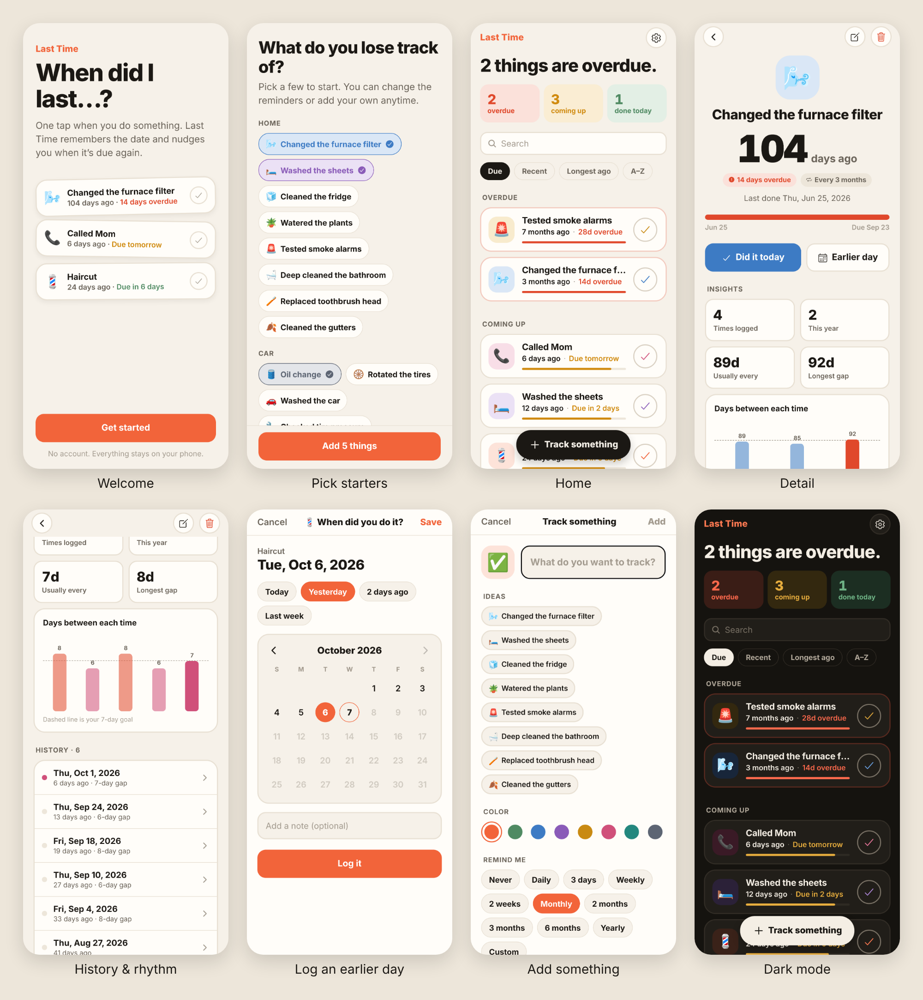

# Last Time

**When did I last…?** Track the last time you did anything. Tap once when you do it; get one quiet morning nudge when it's due again.

Built with Expo (SDK 57) + Expo Router + TypeScript. Fully on-device: no server, no accounts, no API keys.



## Features

- **One-tap logging** with haptics and an Undo toast. Long-press the circle to log an earlier day.
- **Smart status**: Overdue / Coming up / On track / Just tracking, with progress bars.
- **Reminders**: one local notification per day max, at the time you choose. Anything overdue is rolled into the next morning's reminder. Optional app-icon badge with the overdue count. Tapping a reminder opens that item.
- **Detail view**: big "104 days ago", due date, insights (times logged, usual gap, longest gap, this year), a gap chart against your goal, and full editable history with notes.
- **"You usually do this every ~N days"**: suggests a reminder interval from your real history.
- **Onboarding** with 30+ starter ideas (home, car, health, people, pets).
- **Backup & restore** to a JSON file via the share sheet. Data also rides along in the iPhone's iCloud backup.
- Light and dark mode, search, four sort modes, VoiceOver labels.

## Run it

```bash
npm install
npx expo start
```

Scan the QR code with the **Expo Go** app to try it on your phone. For the exact production behavior (icon, splash, reminders), use a TestFlight build.

To see the web preview with sample data: `npx expo start --web`, then open `http://localhost:8081/?demo`.

## Always-current preview in Expo Go

Every push to `main` publishes the app to expo.dev (EAS Update) through `.github/workflows/expo-preview.yml`, so anyone with Expo Go can open the latest version without your computer running.

**One-time setup**
1. Create an access token at expo.dev → Account settings → Access tokens.
2. In this repo, open Settings → Secrets and variables → Actions → **New repository secret**. Name it `EXPO_TOKEN` and paste in the token.
3. Optional: if the app should live under an Expo organization (for example RevvLaunch) instead of your personal account, open the **Variables** tab and add `EXPO_ACCOUNT` with the organization's name.
4. Go to Actions → **Expo preview** → **Run workflow**, or just push a commit.

The first run creates the `last-time` project on expo.dev, then commits the project ID to `app.json` on its own.

**Opening it**
- Open the latest run under the Actions tab. The summary has a QR code; scan it with your iPhone camera.
- Or go to expo.dev → Last Time → Updates → the newest `main` update → **Preview**.
- Every pull request gets its own preview, with a QR code posted as a comment on the PR.

Expo Go has to be on the same SDK as the app (SDK 57). If it says the project is incompatible, update Expo Go from the App Store.

## Ship it to the App Store

You need an Apple Developer account ($99/yr). If you already set one up for The Good Things, use the same one.

1. **Build and upload** (cloud build, no Mac needed):
   ```bash
   npx eas-cli@latest login
   npx eas-cli@latest build --platform ios --profile production --auto-submit
   ```
   The first run asks you to log in to Apple. EAS creates the certificates and the App Store Connect record, then uploads the build to TestFlight. Bundle ID: `com.revvlaunch.lasttime` (change it in `app.json` before the first build if you want).
2. **Host the privacy policy**: upload `store/privacy.html` to `revvlaunch.com/last-time/privacy`. Apple requires a working URL.
3. **Fill in App Store Connect** using `store/listing.md` (name, subtitle, keywords, description, category, review notes). Privacy label: **Data Not Collected**.
4. **Screenshots**: upload `store/screenshots/appstore-1…5.png` to the 6.9" iPhone slot.
5. **Submit for review.** Usually about a day.

After the app is live, put its App Store ID into the "Rate Last Time" link in `src/app/settings.tsx` (search for `id0000000000`) and ship that in the next update.

## Project layout

```
src/app/            screens (Expo Router)
  index.tsx         home list
  welcome.tsx       onboarding
  item/[id].tsx     detail + history
  edit.tsx          add / edit (modal)
  log.tsx           log an earlier day / edit an entry (modal)
  settings.tsx
src/components/     ItemCard, CalendarPicker, Toast, shared UI
src/lib/
  store.tsx         state + AsyncStorage persistence
  reminders.ts      local notification scheduling + badge
  time.ts           "days ago", due math, insights
  templates.ts      starter ideas + emoji set
  backup.ts         export / import JSON
  demo.ts           sample data for ?demo previews and screenshots
store/              App Store listing copy, privacy policy, screenshots
```

## Ideas for v1.1

- Home screen widget (needs a native widget target via a config plugin)
- iCloud sync between iPhone and iPad
- Categories / folders and a "Last Time Pro" unlock for unlimited items + themes (RevenueCat)
- Siri / Shortcuts: "Hey Siri, I changed the furnace filter"
